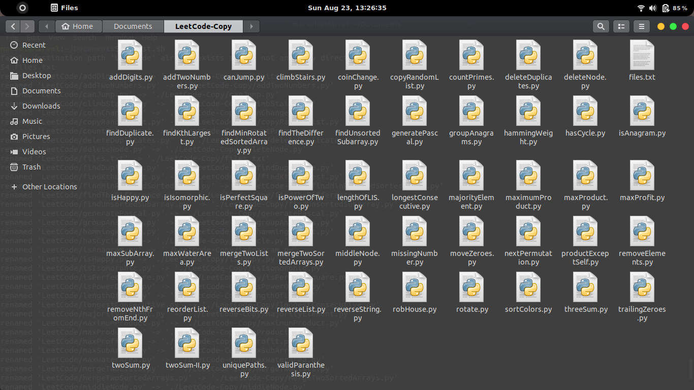

# GitHub-Repo-Files

Shell script to get the number of files from a Github repository,and have a Copy of the repository locally.The Copy folder gets updated with new files at the time of running the script.

## Running 
In your terminal:
```
$ chmod +x test.sh
$ ./test.sh
```

Terminal:


Folder:


Documentation : https://ubuntu.com/tutorials/command-line-for-beginners 
